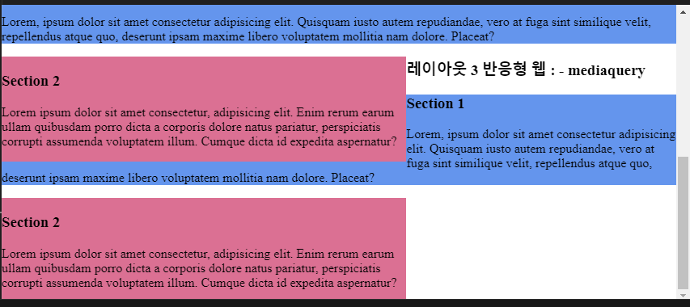

# CSS(Cascading Sytle Sheet)

- 웹 페이지의 표현(디자인)을 나타내는 언어
- 특정 요소를 선택해서 원하는 "스타일"과 "기능"을 적용시킬 수 있음

```css
선택자(누구한테) {
    속성(어떤효과) : 값(얼마큼);
}
```

## 스타일 적용 방법

### 내부 방식

1. 인라인 방식

```html
<태그 style="속성 : 값; 속성:값;"></태그>
```

2. 내부 스타일

```html
<head>
    <style>
        선택자{
            속성 : 값;
            속성 : 값;
        }
        </style>
    </head>
```

### 외부 방식

3. 링크 방식

```html
<head>
    <link rel="stylesheet" type="text/css" href="style.css"/>
</head>

```css
선택자{
    속성 : 값;
}

```

## 선택자

1. 전체 선택자 : 

## 선택자 우선순위

1. 동일한 선택자를 사용하는 경우
- 나중에 작성한 스타일 적용

2. 다른 방식의 선택자 사용

- !important > 인라인 방식(style)>아이디 선택자 >클래스 선택자 > 태그 선택자

## 크기를 지정하는 단위

- 절대 크기 
    - **px** : 모니터의 픽셀 단위로 크기를 계산
- 상대 크기
    - em : 부모 요소에서 지정한 폰트의 크기를 1em으로 계산
    - **rem** :  최상위 요소('html')에서 지정한 폰트의 크기를 1rem으로 계산
    - %(퍼센트) : 부모 요소의 크기에 대한 상대적인 비율로 계산

## 색상 표현 방법

### 색상 이름 표기법
- 영문으로 색상 이름을 표시하는 방법
- 모든 브라우저에서 표현할 수 있는 색상을 웹 안전 색상(web safe colors)
- 216가지

### 16진수 표기법
- #기호 다음에 6자리 16진수로 표시하는 방법
- 6자리는 앞에서부터 두 자리씩 묶어서 Red, Green, Blue로 표시
= #000000(검은색) ~ #ffffff(흰색)

### rgb/rgba 표기법
- rgb 표기법은 16진수 표기법과 다르게 10진수로  red, Green, 
Blue를 표시
- rgba 표기법은 rgb에 불투명도 값을 추가로 지정(0은 완전 투명, 
1은 완전 불투명)

```

rgb(red(0~255), green(0~255), blue(0~255));
rgb(red(0~255), green(0~255), blue(0~255), alpha(0~1));
```


### hsl/hsla 표기법

- hsl 표기법은 앞에서부터 생상(hue), 채도(saturation), 밝기
(brightness)를 표시
- hsla 표기법은 hsl에 불투명도 값을 추가로 지정
- 색상(hue)은 색상환으로 표시(0~360, 360-빨간색, 120-초록색,
 240-파랑색)
- 채도(saturation)는 %로 표시(0% 회색톤, 100%는 순색)
- 밝기(brightness)는 %로 표시(0%는 가장 어둡고, 100% 가장
밝다)


# 레이아웃 스타일

## 박스 모델(Box Model)
- https://user-images.githubusercontent.com/26870393/171997651-ad16e3e9-f88c-490b-b052-b7cb6235f8f7.png
- 모든 요소들은 사ㅏㄱ형 박스로 표현되는데 스타일 시트에서는 박스 
형태인 요소를 박스 모델이라고 한다.
- CSS를 사용하면 박스 모델 요소의 크기, 위치, 속성을 변경할 수
있다.
- 박스 모델은 콘텐츠(CONTENT)영역과 테두리(border)와
  콘텐츠 영역 사이의 여백인 패딩(padding),
  박스 모델 사이의 여백인 마진(margin)으로 구성된다.

  ### float, clear
  -float 속성은 요소의 위치를 왼쪽(left)이나 오른쪽(right)으로 
  배치하는 속성
  -float 속성을 사용해 요소를 배치하면 다음 요소에 영향을 
  미치는데 이를 초기화시키는 속성이 clear 속성

  ## position
  
  - 웹 문서 안에서 요소들을 자유롭게 배치하는 속성
  - static : 문서의 흐름에 맞추어 요소를 배치(기본값)
  - relative : 부모 요소에 연결해 배치하면서 
    위치를 지정하여 요소를 배치
  - absolute : 원하는 위치를 지정하여 요소를 배치
  - fixed : 지정한 위치에 고정하여 요소를 배치
  - 속성값이 static을 제외한 나머지들은 좌표를 이용해서 요소의
  위치를 조절할 수 있다.
  - 위치는 top, bottom, left, right로 지정할 수 있다.
  
  # 반응형 웹

  - 구간 별 페이지 제작 : pc, tablet, mobile
  - viewport(스마트폰 화면에서 실제 내용이 표시되는 영역) 작성
  
  ```html
  <meta name="viewport" content="속성1=값, 속성2=값, ....">
  ```
  <!-- 들어가는것들 -->
  - width : 뷰포트 너비(device-width or 크기)
  - height : 뷰포트 높이(device-height or 크기)
  - user-scalable : 확대/축소 가능 여부(yes or no, yes:기본값)
  - initial-scale : 초기 확대/축소 값(1~10, 1 : 기본값)<!-- 확대 축소   -->
  - minimum-scale : 최소 확대/축소 값(0~10, 0.25 : 기본값)
  - maximum-scale : 최대 확대/축소 값(0~10, 1.6 : 기본값)

  ## 미디어쿼리(Media Queries)

  - 사이트에 접속하는 장치에 따라 특정한 css스타일을 적용

```css
@media 미디어유형 and[ 조건]....{

}
@media screen and(min-width: 200px) and(max-width: 360px){
 ...   
}
/* 추천 */
@media screen and(min-width:700px){

}/* 민위드값만 쓰는것 추천, 이유는 ...최소단위 ~최대 */
```


# Flex(Flexible Box, Flexbox)

- CSS 레이아웃 모델로 화면 크기에 따라 레이아웃의 배치나 크기를
  조절할 때 편리하게 사용
```html
<div class="container">
    <div class="item"></div>
    <div class="item"></div>
    <div class="item"></div>
    </div>
```

## display : flex;

- Flex 컨테이너에 display:flex;를 적용하면서 시작

```css
.container{
    display: flex;
}
```

## flex-direction

- 배치 방향 설정
- 아이템들이 배치되는 메인축의 방향을 결정하는 속성임.

```css
.container{
    flex-direction: row or column or row-reverse or 
    column-reverse;
}
```

- row는 왼쪽부터 순차적 배치(기본값)
- row-reverse :오른쪽부터 순차적 배치
- column : 위에서 아래로 순차적 배치
- column-reverse : 아래에서 위로 순차적 배치

## flex-wrap

- 아이템 줄바꿈을 어떻게 할지 결정하는 속성

```css
.container{
    flex-wrap: nowrap or wrap or wrap-reverse;
}
```

- nowrap : 줄바꿈을 하지 않음
(기본값)
- wrap : 줄바꿈
- wrap-reverse : 역순으로 배치 후 줄바꿈

## flex-flow

- flex-direction과 flex-wrap을 한꺼번에 지정할 수 있는 단축 속성
```css
.container{
    flex-flow : flex-direction flex-wrap;
}
```css

## justify-content

- 메인축 방향으로 정렬
.container {
    justify-content: flex-start or flex-end or center
    or space-between or space-around
    or space-evenly;
}
```
- flex-start : 아이템들을 시작점으로 정렬(기본값)
- flex-end :  아이템들을 끝점으로 정렬
- center : 아이템들을 가운데로 정렬
- space-between : 아이템들 사이에 균일한 간격으로 정렬
- space-around : 각 아이템의 좌우에 균일한 간격으로 정렬
- space-evenly : 아이템들의 사이와 양 끝에 균일한 간격으로 정렬

## align-items

- 수직축 방향으로 정렬


```css
.container{
    align-items: stretch or flex-start or flex-end or center
    or baseline;
}
```
- stretch : 아이템들을 위아래 방향으로 끝까지 늘림(기본값)
- flex-start : 아이템들을 위쪽으로 정렬
- flex-end : 아이템들을 아래쪽으로 정렬
- center : 아이템들을 중간 정렬
- baseline : 아이템들을 텍스트 베이스라인 기준으로 정렬

## align-content

- 여러 행 정렬
- flex-wrap: wrap; 이 설정된 상태에서, 아이템들의 행이 2줄
이상인 경우 수직축 방향 정렬을 결정하는 속성
```css
.container{
    align-content: stretch or flex-start or flex-end or center
    or space-between or
    space-around or space-evenly
}
```

## flex-basis
- flex 아이템의 기본 크기 설정(flex-direction이 row일 때는 너비,
column일 때는 높이)

```css
.item{
    flex-basis : auto or 0 or 크기;
}
```

## flex-grow

- flex-basis의 값보다 커질 수 있는지를 결정하는 속성
```css
.item{
    flex-grow: 0 or 숫자;
}
```

## flex-shrink

- flex-grow와 쌍을 이루는 속성으로, flex-basis 값보다 작아질 수
있는지를 결정하는 속성
```css
.item{
    flex-shrink: 1 or 숫자;
}
```
## flex
-flex-grow, flex-shrink, flex-basis를 한 번에 쓸 수 있는 속성
```css
.item{
    flex: 1 1 auto;
    /* flex-grow : 1; flex-shrink: 1;
    flex-basis: auto; */

    flex: 1 500px; 
    /* flex-grow 1;  flex-shrink:1;
    flex-basis: 500px; */
    
    flex: 1;
    /* flex-grow: 1; flex-shrinkL 1; flex-basis: 0%; */
}
```

## align-self

- 특정 아이템만 정렬을 따로 정렬하고자 할 때 사용하는 속성

```css
.item{
    align-self: flex-start or flex-end or center or baseline 
    or stretch;
}
```

## order
- item들의 순서를 바꿀 수 있는 속성


```css
.item{
    order: 0 or 숫자;
}
```
# Grid
- css 레이아웃 모델로 한 방향 레이아웃인 플렉스와 달리 두 방향
(가로-세로) 레이아웃
```html
<div class="container">
    <div class="item"></div>
    <div class="item"></div>
    <div class="item"></div>
    <div class="item"></div>
</div>
```
## display: grid;

- Grid 컨테이너에 display:grid;를 적용하면서 시작

```css
.container{
    display: grid;
}
```

## grid-template-rows, grid-template-columns

- 컨테이너에 Grid 트랙(행 또는 열)의 크리들을 지정해주는 속성
```css
.container{
    grid-template-colums: 200px 500px;
}
```
### auto-fill, auto-fit

- column의 개수를 미리 정하지 않고 설정된 너비가 허용하는 한 
최대한 셀을 채움
- auto-fill은 셀의 개수가 모자라면 공간이 남지만, auto-fit은 
채움

## row-gap, column-gap, gap

- 그리드 셀 사이의 간격을 설정하는 속성
- 예전 브라우저에서는 grid-get 사용

## grid-auto-colums, grid-auto-rows
- 통제를 벗어난 위치에 있는 트랙의 크기를
지정하는 속성

```css
.container
{
    grid-auto-rows: minmax(200px, auto)
}
```

## grid-column-start, grid-column-end, grid-column,
grid-row-start, grid-row-end, grid-row

```css
.item{
    grid-column. 1/4;
    grid-column-start: 1;
    grid-column-end: 4;

    grid-row: 2/4;
    grid-row-start: 2;
    grid-row-end: 4;
}
```
```css
/* 4. gap */
column-gap: 20px;
row-gap: 30px;
gap: 10px;

/* 5.grid-auto-rows */
grid-auto-rows: minmax(200px, auto);

```


## jistify-items,
align-items
```css
- 셀들의 정렬을 지정하는 속성

  .container { /* 6. justify-items, align-items */
    justify-items: start;
    justify-items: center;
    justify-items: end;

    align-items: start;
    align-items: center;
    align-items: end;
}
```
## justify-self, align-self

- 각 하나의 셀의 정렬을 지정하는 속성
```
```css
.item:nth-child(6) {
    justify-self: start or center or end;
    align-self: start or center or end;
}
```